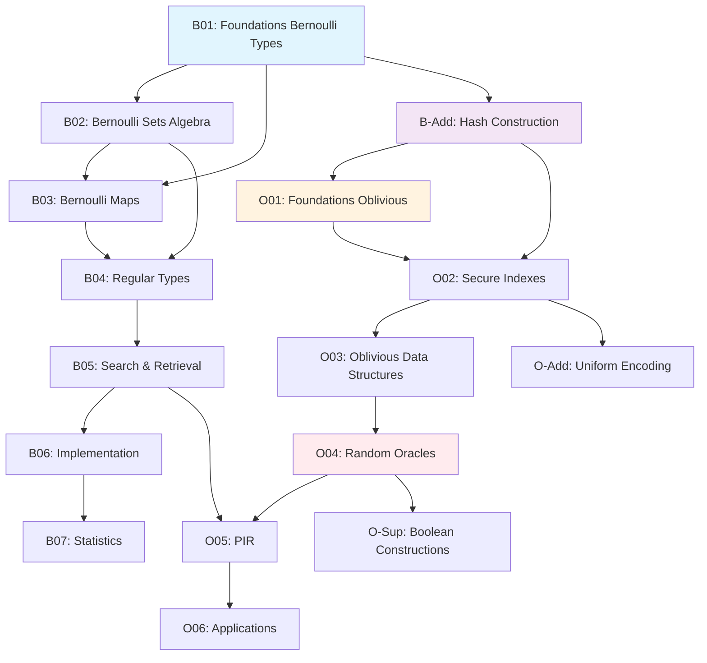

# Comprehensive Paper Interconnection Map
## How All Papers Connect and Build Upon Each Other

---

## 📊 Master Dependency Graph



---

## 🔗 Detailed Interconnections

### Bernoulli Series Internal Connections

#### B01 → B02: Foundations to Sets
**Concepts Passed Forward:**
- Definition of Bernoulli types B^k(T)
- Error rate notation (α, β)
- Approximation semantics

**Concepts Developed:**
- Set algebra operations
- Error propagation rules
- Union/intersection with controlled errors

#### B02 → B03: Sets to Maps
**Concepts Passed Forward:**
- Set membership as special case of maps
- Error composition
- Algebraic properties

**Concepts Developed:**
- Generalization from sets to arbitrary functions
- Map composition rules
- Universal approximation

#### B03 → B04: Maps to Regular Types
**Concepts Passed Forward:**
- Functional approximation
- Composition semantics

**Concepts Developed:**
- Regular type interface
- Formal language theory connection
- Automata with errors

#### B04 → B05: Regular Types to Search
**Concepts Passed Forward:**
- Type system
- Error guarantees

**Concepts Developed:**
- Boolean query processing
- Document retrieval with false positives
- Ranking with approximation

#### B05 → B06: Search to Implementation
**Concepts Passed Forward:**
- Search algorithms
- Performance requirements

**Concepts Developed:**
- Bloom filters
- Hash tables with errors
- Practical data structures

#### B06 → B07: Implementation to Statistics
**Concepts Passed Forward:**
- Empirical error rates
- Performance metrics

**Concepts Developed:**
- Statistical analysis
- Confidence intervals
- Hypothesis testing for Bernoulli types

---

### Cross-Series Connections

#### B-Addendum → O01: Hash Construction Bridge
**Critical Bridge Concepts:**
```
Hash Construction = The Rosetta Stone
- Bernoulli side: Implementation technique
- Oblivious side: Security foundation
```

**Shared Concepts:**
- Seed finding algorithm
- ValidEncodings sets
- Hash uniformity requirement

#### B05 → O05: Search Connections
**Parallel Development:**
- B05: Boolean search with false positives
- O05: Private information retrieval
- Shared: Query processing algorithms

**Key Difference:**
- B05: Focuses on efficiency
- O05: Focuses on privacy

---

### Oblivious Series Internal Connections

#### O01 → O02: Foundations to Secure Indexes
**Concepts Passed Forward:**
- Oblivious type definition
- Uniformity requirements
- Threat model

**Concepts Developed:**
- Secure index construction
- Entropy maximization
- Bernoulli maps for obliviousness

#### O02 → O03: Indexes to Data Structures
**Concepts Passed Forward:**
- Index structures
- Oblivious operations

**Concepts Developed:**
- Oblivious sets, maps, arrays
- Compositional obliviousness
- Performance analysis

#### O03 → O04: Data Structures to Random Oracles
**Concepts Passed Forward:**
- Oblivious primitives
- Composition challenges

**Concepts Developed:**
- Fundamental tension (functionality vs uniformity)
- Correlation leakage
- Update protocols (MAB method)

#### O04 → O05: Random Oracles to PIR
**Concepts Passed Forward:**
- Correlation management
- Update timing

**Concepts Developed:**
- Query obfuscation
- Tuple encoding
- N-gram indexing

#### O05 → O06: PIR to Applications
**Concepts Passed Forward:**
- Complete PIR system
- Obfuscation techniques

**Concepts Developed:**
- Real-world systems
- Encrypted search
- DeFi applications

---

## 🔄 Concept Flow Map

### Core Concepts and Their Evolution

#### 1. **Error Rate (β)**
```
B01: Introduced as false negative rate
 ↓
B02-B07: Refined for different operations
 ↓
O01: Reinterpreted as privacy parameter
 ↓
O02-O06: Balanced against security needs
```

#### 2. **Hash Functions**
```
B06: Implementation detail for Bloom filters
 ↓
B-Add: Formalized as construction method
 ↓
O01: Elevated to security primitive
 ↓
O02-O06: Foundation of obliviousness
```

#### 3. **ValidEncodings**
```
B-Add: Introduced for hash construction
 ↓
O01: Connected to uniformity
 ↓
O02: Sized by 1/p(x) principle
 ↓
O04-O05: Managed for correlation hiding
```

#### 4. **Composition**
```
B03: Function composition with error propagation
 ↓
B04: Regular type composition
 ↓
O03: Oblivious composition challenges
 ↓
O04: Correlation leakage through composition
```

#### 5. **Boolean Operations**
```
B02: Set operations (∪, ∩, ¬)
 ↓
B05: Boolean queries (AND, OR, NOT)
 ↓
O05: Oblivious Boolean search
 ↓
O-Sup: XOR vs OR constructions
```

---

## 📈 Complexity Progression

### Mathematical Sophistication
```
Simple                                          Complex
B01 ──→ B02 ──→ B03 ──→ B04 ──→ O01 ──→ O04 ──→ Theory Gap
(basic)  (algebra) (category) (formal) (crypto) (tension)
```

### Implementation Complexity
```
Simple                                          Complex
B06 ──→ B-Add ──→ O03 ──→ O05 ──→ O06 ──→ Implementation Gap
(bloom) (hash)  (obliv DS) (PIR) (systems)
```

---

## 🎯 Key Innovation Points

### 1. **The Hash Construction** (B-Addendum)
- Links Bernoulli approximation to uniform distributions
- Enables transition from efficiency to security

### 2. **The 1/p(x) Principle** (O02)
- Frequency-based encoding sizes
- Achieves uniform observations

### 3. **Tuple Encoding** (O05)
- Hides correlations in compound queries
- Enables truly private Boolean search

### 4. **MAB Method Integration** (O04)
- Determines when to update oblivious functions
- Quantifies adversary learning

### 5. **Compositional Obliviousness** (O03-O04)
- Identifies the tension
- Proposes practical solutions

---

## 🔍 Missing Links Identified

### Within Bernoulli Series:
- B04 → B05: Formal connection between regular types and search
- B07 → Others: Statistical insights not fed back

### Cross-Series:
- B03 (Maps) ←→ O03 (Oblivious DS): Parallel development not connected
- B07 (Statistics) → O04 (Update timing): Statistical methods could inform

### Within Oblivious Series:
- O-Supplemental: Somewhat disconnected from main flow
- O06 → Feedback: Applications don't inform theory refinement

---

## 💡 Synthesis Insights

### The Papers Form Three Layers:

#### 1. **Theoretical Foundation**
- B01-B04: Mathematical framework
- O01, O04: Security theory
- Gap docs: Formal proofs

#### 2. **Algorithmic Development**
- B05: Search algorithms
- O02-O03, O05: Oblivious algorithms
- Addendums: Construction methods

#### 3. **Practical Systems**
- B06-B07: Implementation and analysis
- O06: Real applications
- Other/: Working code

### The Unified Story:
```
Approximation Theory + Information Theory + Cryptography
         ↓                    ↓                 ↓
  Bernoulli Types    +  Uniform Hashing  + Oblivious Computing
                      ↓                 ↓
                 Privacy-Preserving Systems
```

---

## 📚 Implications for Book Structure

Based on this interconnection analysis, a book should:

1. **Follow the natural progression** identified in progression_map.md
2. **Highlight bridge concepts** that connect series
3. **Fill missing links** between papers
4. **Provide unified notation** across all concepts
5. **Include implementation** from other/ directory
6. **Add exercises** that span multiple papers

The interconnections show the work forms a coherent whole, despite being published as separate papers. The book would be the definitive unified treatment.